# garbanzo

[screencast-localhost_8080-2023.06.03-00_12_54.webm](https://github.com/kijimaD/garbanzo/assets/11595790/06fd7c99-bd99-48eb-873b-34a6d6ab511b)

## how to use

Install

```
$ go install github.com/kijimaD/garbanzo@main
```

Run

```
$ GH_TOKEN=xxx garbanzo
```

Need GitHub Personal Access Token(**notification scope**)! Token is used to fetch users notifications.

and, access http://localhost:8080

## docker run

```
$ docker run --rm -it --env GH_TOKEN=xxx -p 8080:8080 -p 8081:8081 ghcr.io/kijimad/garbanzo:latest
```

## image




## Reference

- [Githubのタイムラインや通知を見るアプリをnode\-webkitで作った \| Web Scratch](https://efcl.info/2014/0430/res3872/)を見て、自分で作ってみようと思った。
- WebSocketまわりは[O'Reilly Japan \- Go言語によるWebアプリケーション開発](https://www.oreilly.co.jp/books/9784873117522/)のチャットルームのコードを参考にした。
