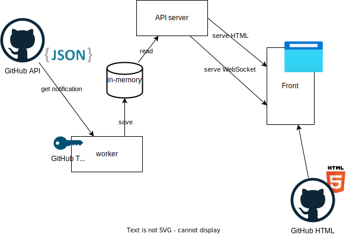

# garbanzo


## install

```
$ go install github.com/kijimaD/garbanzo@main
```

## how to use

Need GitHub Token(notification scope). Token is used to fetch user notification.

```
$ GH_TOKEN=xxx garbanzo
```

and, access http://localhost:8080

## docker run

```
$ docker run -v "$PWD/":/work -w /work --rm -it ghcr.io/kijimad/garbanzo:latest
```

## image




## Reference

- [Githubのタイムラインや通知を見るアプリをnode\-webkitで作った \| Web Scratch](https://efcl.info/2014/0430/res3872/)を見て、自分で作ってみようと思った。
- WebSocketまわりは[O'Reilly Japan \- Go言語によるWebアプリケーション開発](https://www.oreilly.co.jp/books/9784873117522/)のチャットルームのコードを参考にした。
